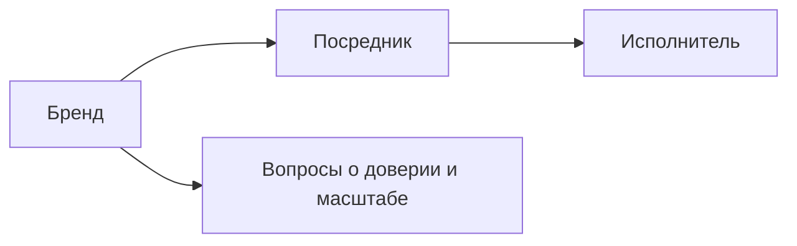

Это мой исходный canvas, разложенный для чтения на сайте. Файл `Иерархия дохода.canvas` лежит рядом и открывается в Obsidian.

## Бренд

Посредники работают от твоего лица. Потолок по стуи становится неограниченным, все сделки заключаются от твоего лица

## Посредник

Ты ведешь коммуникацию с людьми, ты находишь эти проекты, ты входишь в долю, берешь оплату.

Потом находишь исполнителей и отдаешь им часть "зарплату"
Потолок по сути - это количество твоих созвонов

## Исполнитель

Ты работаешь с 3 проектами и моежшь увеличить условно до 500к свой доход взяв 6 проектов, но это будет твой потолок.
Ты не будешь заниматься ничем, кроме проектов и расти ты дальше никак не будешь

## Вопрос

выходит, что путь наименьшего сопротивления к большему доходу  - грамотное использование человеческого ресурса
Я его я терпеть не могу использовать и не умею.

## Можно ли обойти стадию "посрденика" и активных созвонов, продаж идеи и себя?

Как раз сюда относится моя идея и стремление к Tech особенно к блокчейну, потому что я могу сделать неограниченное количесвто систем и ботов, работающих на меня, любая сделка - консенсус или смарт контракт

## Как мне прийти к этому?

Как научиться грамотно продавать идею, чтобы люди отдавали мне свои деньги, хотели со мной работат, доверяли мне?
Где мне находишь вообще этих людей и знакомится с ними? Как прийти к своему первому миллиону?

## Фокус на собеседнике

1) Фокусируйся всегда на собеседнике, чем больше ты на нем сфокусирован, слуашешь, чувствуешь его боли и потребности, тем притягательнее ты становишьс для него, увереннее в себе.
   
   молоканов вторая втсреча
   встреча с молокановом

## Слушать и отделять свои чувства от чужих

2. Большую часть времени человек говорит о себе и проецирует буквально свою потребность, нужно лишь прислушаться.
    Нужно также уметь отделять свое чувство от чужого. Чаще всего, если я почувствовала себя глупой рядом с человеком, значит он намеренно себя так вел и где-то у него бла потребность показаться умным за счет меня в диалоге, это также нужно ловить (без учета личных паттернов повторяемых)

## Убрать зависимость от чужой валидации

